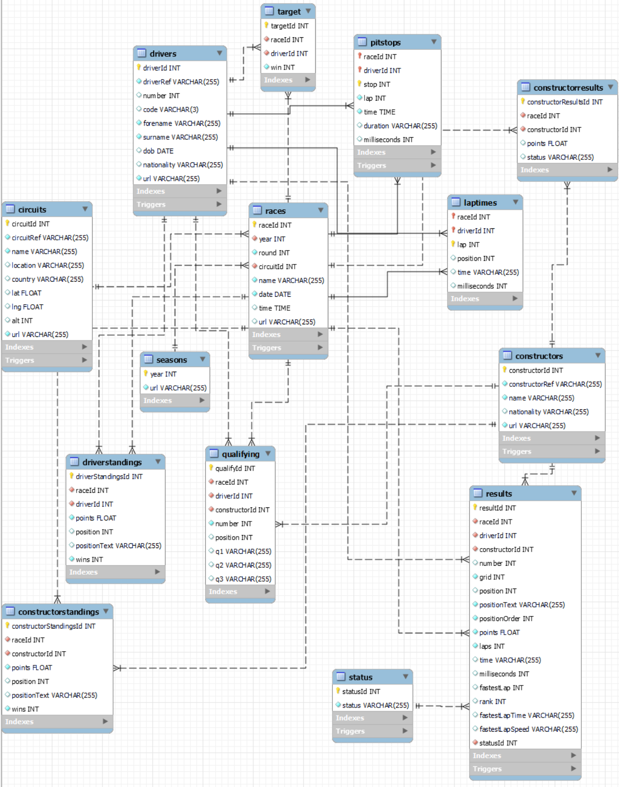
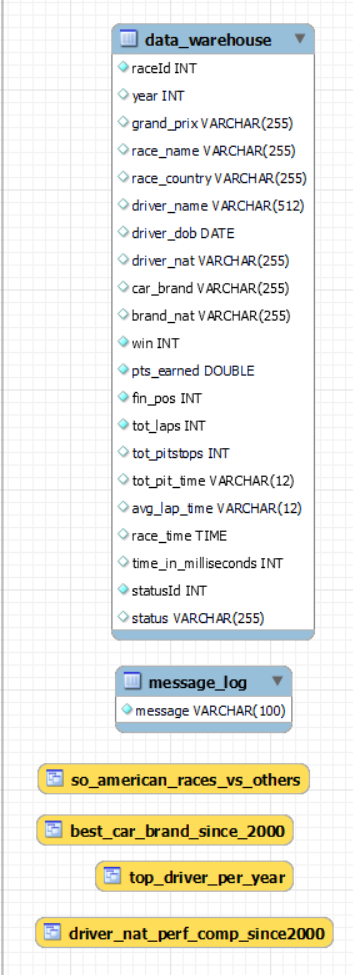

# Data Engineering Project - F1 SQL Database
Data Engineering Term Project 1 - F1 Dataset
### Data Source
The SQL data dump was taken from the relational.fit.cvut.cz MySql Workbench server. The SQL dump itself was derived from the Ergast F1 databse API. The data contains information about F1 racing from 1950-2017.  

## Files  
To load the database and all operations please upload and run the following files in order from the Term1 folder in this repo:
1. `formula1_data_dump.sql` - SQL data dump file for schema and table creation along with all data insertions
2. `f1_etl.sql` - SQL file containing the ETL pipeline and triggers
3. `f1_queries.sql` - SQL file containing simple queries to show views and test if ETL pipeline works properly
Conversely if you would like to have them all combined into one file, then please load the `F1_DE1_TP1.sql` file from the repo, however this may be slower.

Additionally, the EER diagram for this SQL database `f1_eer.mwb` has been created for you to open and view in MySQL Workbench as well.
Additionally screenshots of the EER diagram have been made available within this repo.

## Operational Layer

## Analytical Layer

Triggers are set up to provide a message into the `message_log` table whenever an insertion is made into the following tables:
1. `circuits`
2. `constructors`
3. `drivers`
4. `pitstops`
5. `races`
6. `results`
7. `status`

An event `CreateEventDW` is set up to run at current time and every minute for 5 minutes after initialized. This event calls the `CreateDataWarehouse` and `CreateDataMarts` procedures to generate and update the analytical tables if an insertion were to occur. The event also creates a message into the message_log every time an interval is run.  

## Analytics Plan
Pulled from the Ergast F1 database API (as noted above), this database contains information from 1950-2017 on races along with information recorded during the time frame including statistics about each race, each driver, laptimes, and more.
### Data Warehouse table
An analytical table was created pulling together information from avialable tables, as shown in the image above. Data transformations that occur at this stage are the following:
1. Concatenation of driver `surname` and `forename`
2. Creation of a boolean column `win` based on `positionOrder` to denote whether the driver won that race
3. Aggregating both `stop` and `milliseconds` from the `pitstops` table to show total pitstops made during a race along with total time spent at a pitstop. Data for this was sparse in the dataset
4. Use the `milliseconds` and `laps` columns from the `results` table to calculate average lap time and total race time for reformatting purposes, was not formatted in a readable format in original data
5. Linking `driverId` and `constructorId` to information about dirvers and constructors (brands) in one analytical table, all grouped by each
### Data Marts
The following data marts (views) were created from the `data_warehouse` table:
1. `So_American_races_vs_others` - Comparison between South American circuits and circuits from the rest of the world to see if South American drivers perform better in their home continent or not
2. `best_car_brand_since_2000` - Performance comparison of constructor (car) brands since 2000 with a minimum of 50 races participated by average finishing position also showing total points earned
3. `driver_nat_perf_comp_since2000` - Performance comparison of drivers grouped by their nationality since 2000 to show which nationality has performed best where time data is not null and race status = "Finished"
4. `top_driver_per_year` - Shows the top point earning driver per year available from the dataset. Ranking statistic created in original view, additional query filters to show rank = 1 for each year

## Testing
The `f1_queries.sql` file runs some simple queries as noted above as well as provides an additional filter when viewing the `top_driver_per_year` data mart
